<!--more-->

<h1 align="center">使用Hugo+GithubPage搭建个人博客</h1>


### 1.前置准备
  * 安装git
  * 安装Hugo，当前环境用的是mac，直接通过homebrew安装
    ```bash
    brew install hugo
    ```
    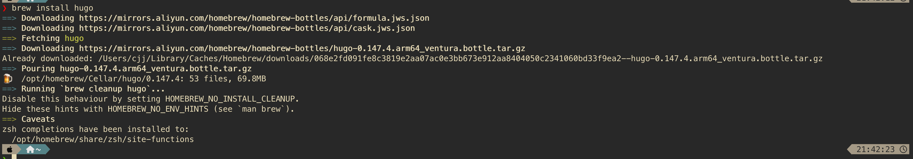
  * 确保hugo版本为 >= v0.128.0
    

### 2.本地创建站点
  * 输入命令创建一个新的站点
    ```bash
    hugo new site blod
    ```
    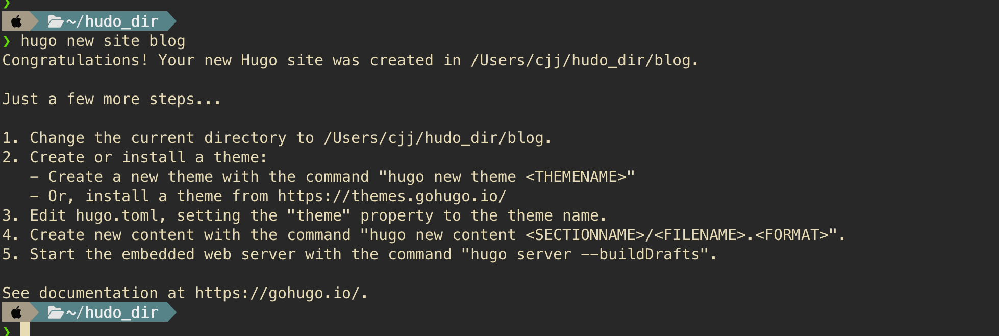
  * 进入刚创建的目录后，初始化git仓库
    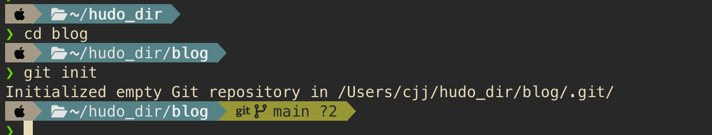
  * 使用git子模块的方式安装ananke主题
    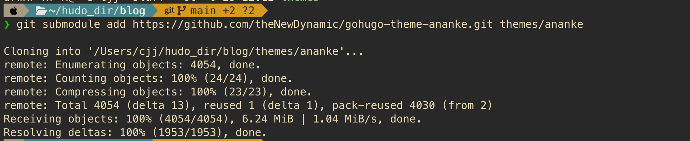
  * 编辑配置文件hugo.toml，设置主题
    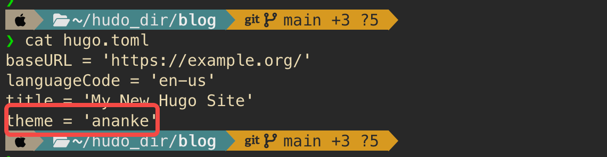
  * 启动服务
    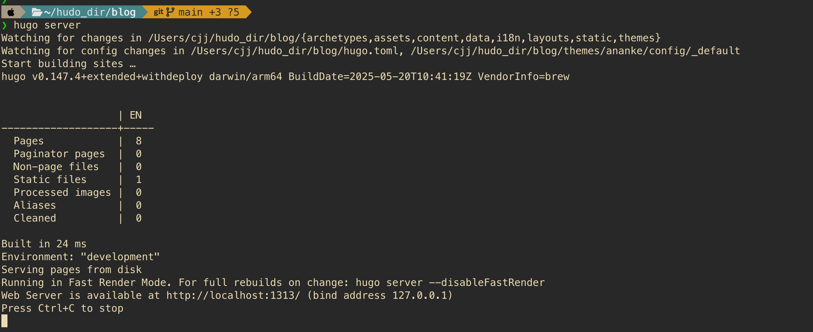
  * 在浏览器中查看网页
    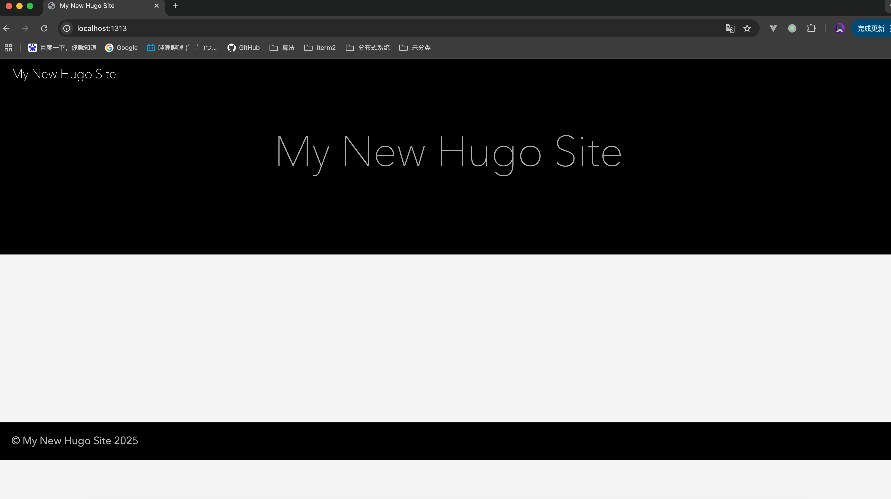
  * 创建文章
    ```bash
    hugo new content content/posts/123.md
    ```
    
  * 文章内容上方的注释里，draft字段默认为true，使用常规的命令启动hugo服务时，不会发布这些"草稿"文章，除非使用以下两种添加了参数的命令
    ```bash
    hugo server --buildDrafts
    hugo server -D
    ```
  * 编辑文章内容后，使用带参数的命令，使草稿文章也可见
    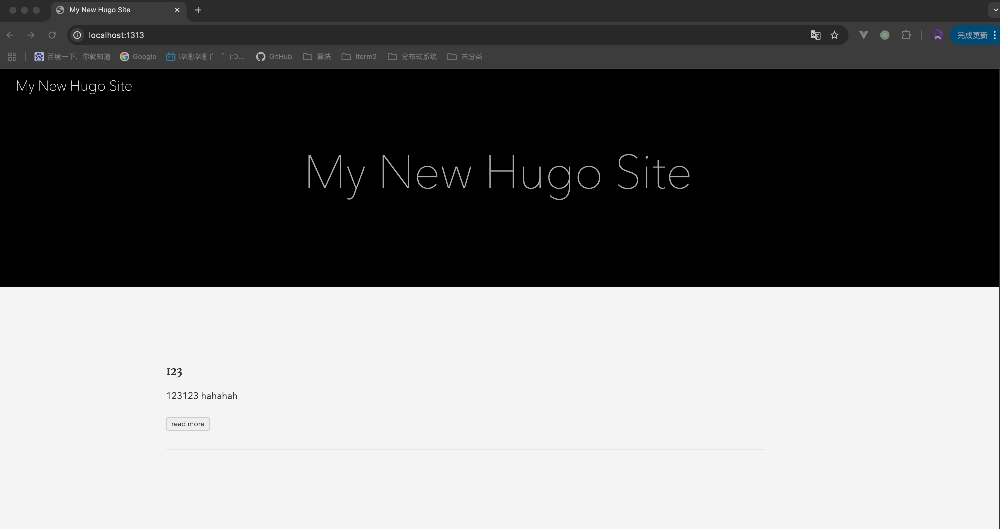

### 3.部署站点到github
  * 创建一个github仓库，并将本地仓库推送到远程
  * 打开仓库的Settings->Pages，将source选项修改为Github Actions
    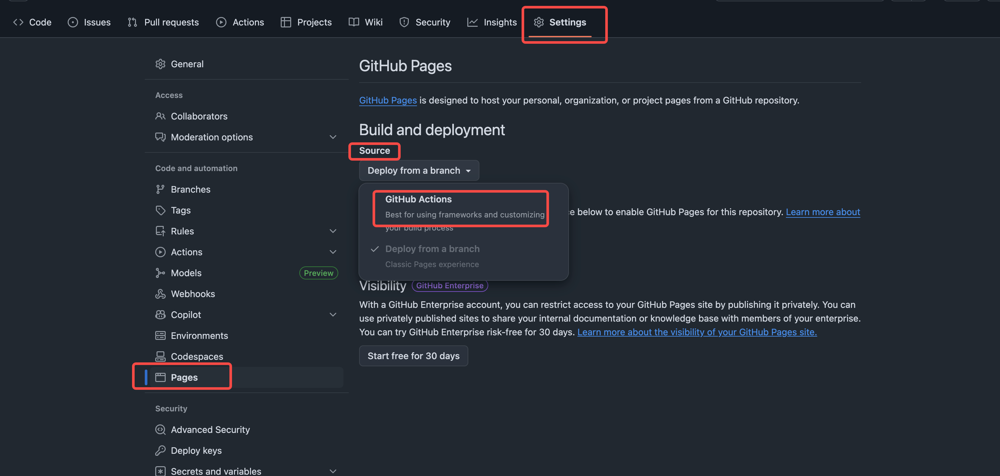
  * 在站点配置文件hugo.toml中修改图片缓存位置
    ```TOML
    [caches]
    [caches.images]
        dir = ':cacheDir/images'
    ```
  * 在站点根目录下创建文件.github/workflows，并在其中创建文件hugo.yaml
    ```bash
    mkdir -p .github/workflows
    touch .github/workflows/hugo.yaml
    ```
    
  * 将下方配置内容复制到刚创建的huog.yaml配置文件中，并根据实际情况修改branch字段和hugo版本字段
    ```yaml
    # Sample workflow for building and deploying a Hugo site to GitHub Pages
    name: Deploy Hugo site to Pages

    on:
      # Runs on pushes targeting the default branch
      push:
        branches:
          - main

      # Allows you to run this workflow manually from the Actions tab
      workflow_dispatch:

    # Sets permissions of the GITHUB_TOKEN to allow deployment to GitHub Pages
    permissions:
      contents: read
      pages: write
      id-token: write

    # Allow only one concurrent deployment, skipping runs queued between the run in-progress and latest queued.
    # However, do NOT cancel in-progress runs as we want to allow these production deployments to complete.
    concurrency:
      group: "pages"
      cancel-in-progress: false

    # Default to bash
    defaults:
      run:
        shell: bash

    jobs:
      # Build job
      build:
        runs-on: ubuntu-latest
        env:
          HUGO_VERSION: 0.147.2
          HUGO_ENVIRONMENT: production
          TZ: America/Los_Angeles
        steps:
          - name: Install Hugo CLI
            run: |
              wget -O ${{ runner.temp }}/hugo.deb https://github.com/gohugoio/hugo/releases/download/v${HUGO_VERSION}/hugo_extended_${HUGO_VERSION}_linux-amd64.deb \
              && sudo dpkg -i ${{ runner.temp }}/hugo.deb
          - name: Install Dart Sass
            run: sudo snap install dart-sass
          - name: Checkout
            uses: actions/checkout@v4
            with:
              submodules: recursive
              fetch-depth: 0
          - name: Setup Pages
            id: pages
            uses: actions/configure-pages@v5
          - name: Install Node.js dependencies
            run: "[[ -f package-lock.json || -f npm-shrinkwrap.json ]] && npm ci || true"
          - name: Cache Restore
            id: cache-restore
            uses: actions/cache/restore@v4
            with:
              path: |
                ${{ runner.temp }}/hugo_cache
              key: hugo-${{ github.run_id }}
              restore-keys:
                hugo-
          - name: Configure Git
            run: git config core.quotepath false
          - name: Build with Hugo
            run: |
              hugo \
                --gc \
                --minify \
                --baseURL "${{ steps.pages.outputs.base_url }}/" \
                --cacheDir "${{ runner.temp }}/hugo_cache"
          - name: Cache Save
            id: cache-save
            uses: actions/cache/save@v4
            with:
              path: |
                ${{ runner.temp }}/hugo_cache
              key: ${{ steps.cache-restore.outputs.cache-primary-key }}
          - name: Upload artifact
            uses: actions/upload-pages-artifact@v3
            with:
              path: ./public

      # Deployment job
      deploy:
        environment:
          name: github-pages
          url: ${{ steps.deployment.outputs.page_url }}
        runs-on: ubuntu-latest
        needs: build
        steps:
          - name: Deploy to GitHub Pages
            id: deployment
            uses: actions/deploy-pages@v4
    ```
  * 然后将配置文件上传到github，打开仓库菜单选项的Actions部分，将会看到如下画面
    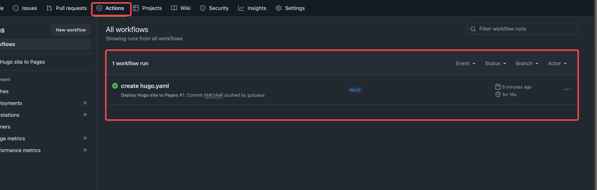
  * 点击提交信息，将会看到以下画面，之后每次从本地仓库提交到远程之后，github都会自动重新构建站点并进行部署
    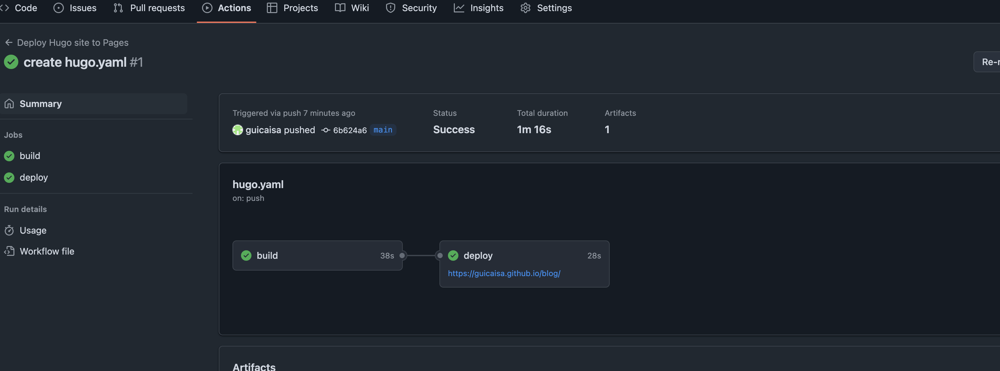
  * 输入GithubPage的相关地址，可以看到站点已经部署好了，能通过外网进行访问
    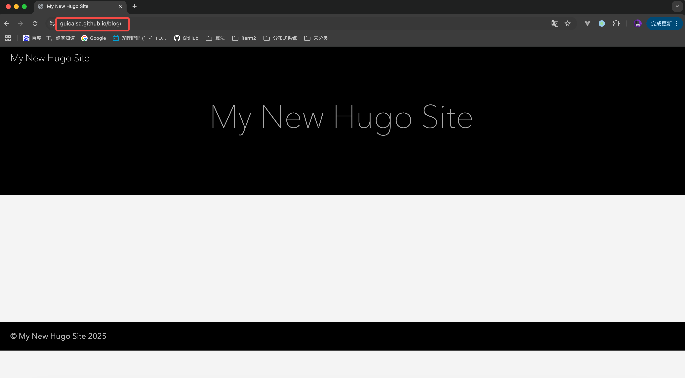

  ### 参考
  * https://gohugo.io/
  * https://gohugo.io/getting-started/quick-start/
  * https://gohugo.io/host-and-deploy/host-on-gitlab-pages/

