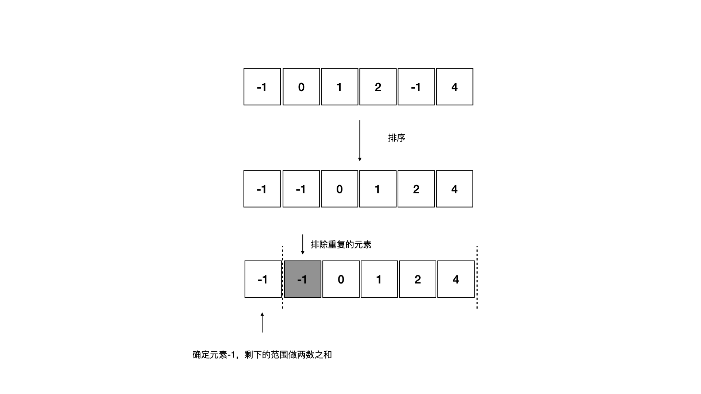

<!--more-->

<h1 align="center">leetcode 15. 三数之和/h1>

### 题目地址
  * https://leetcode.cn/problems/3sum/

### 解法
  1. 排序+双指针
  * 首先对数组进行排序，然后开始遍历数组，将当前遍历的元素视为定点，将问题拆解为两数之和，在剩下的数组范围中处理两数之和问题
  * 由于数组事先进行过排序，所以在单次遍历过程中可以略过多个重复元素，保证结果中不会出现重复，并且在处理两数之和问题时也需要注意略过重复元素
    
  * 有一个特殊情况可以提前结束遍历，即当前元素大于0，由于数组是升序排列的，该元素之后的元素肯定会大于等于这个元素，所以三数之和的结果肯定是大于0的，从该元素起之后的所有元素都无法得到有效的解，可以提前结束遍历
    ```C++
    class Solution 
    {
    public:
        vector<vector<int>> threeSum(vector<int>& nums) 
        {
            sort(nums.begin(), nums.end());
            vector<vector<int>> results;
            for (int i = 0; i < nums.size(); ++i)
            {
                //略过重复元素
                if (i > 0 && nums[i] == nums[i - 1])
                {
                    continue;
                }
                int num = nums[i];
                //num > 0，从该元素开始之后的所有元素都无法得到有效的解，提前退出循环
                if (num > 0)
                {
                    break;
                }
                //在剩下的范围中处理两数之和的问题
                int left = i + 1;
                int right = nums.size() - 1;
                while (left < right)
                {
                    int left_num = nums[left];
                    int right_num = nums[right];
                    int sum = num + left_num + right_num;
                    //有解，记录结果
                    if (sum == 0)
                    {
                        results.push_back(vector<int>{num, left_num, right_num});
                        //移动左边界，尝试略过重复元素
                        while (left < nums.size() && nums[left] == left_num)
                        {
                            ++left;
                        }
                        //移动右边界，尝试略过重复元素
                        while (right >= 0 && nums[right] == right_num)
                        {
                            --right;
                        }
                    }
                    //sum < 0，表示需要获得解，需要更大的值，则移动左边界
                    else if (sum < 0)
                    {
                        while (left < nums.size() && nums[left] == left_num)
                        {
                            ++left;
                        }
                    }
                    //反之移动右边界
                    else 
                    {
                        while (right >= 0 && nums[right] == right_num)
                        {
                            --right;
                        }
                    }
                }
            }

            return results;
        }
    };
    ```

