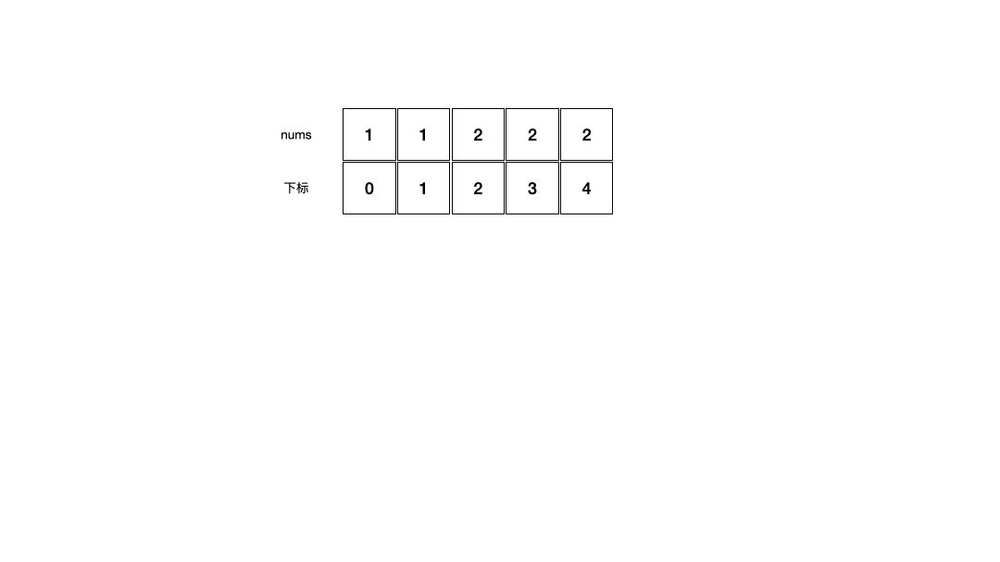

<!--more-->

<h1 align="center">leetcode 26.删除有序数组中的重复项</h1>

### 题目地址
  * https://leetcode.cn/problems/remove-duplicates-from-sorted-array/

### 解法
  1. 双指针
  * 使用一个指针指index向数组的头部，然后使用另外一个指针遍历数组，由于数组是排序好的，所以在遍历过程中遇到与index指针指向元素相同的值时，就直接略过，遇到不同的值则插入到index指针之后，并将index指针往后挪动一位，持续这个过程直到遍历结束，前index+1个元素中不包含重复元素
  
    ```C++
    int removeDuplicates(vector<int>& nums) 
    {
        int index = 0;
        for (int i = 0; i < nums.size(); ++i)
        {
            if (nums[index] == nums[i])
            {
                continue;
            }
            nums[++index] = nums[i];
        }    
        return index+1;
    }
    ```
