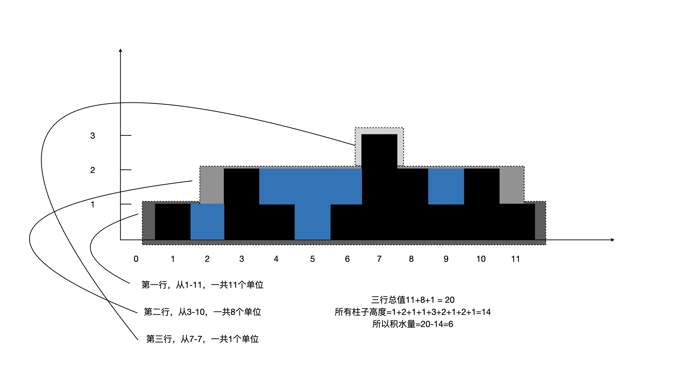
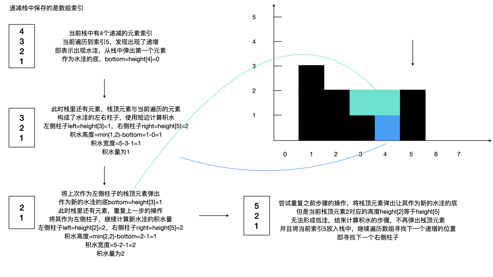

<!--more-->

<h1 align="center">leetcode 42.接雨水</h1>

### 题目地址
  * https://leetcode.cn/problems/trapping-rain-water/

### 解法
  1. 每层累加
  * 在题目的回复中看到的一个比较巧妙的思路，设立左右边界，高度从1开始，只要左右边界比当前高度高，就累加到总数中，不断缩减左右边界中低的一边，直到完全重合，此时的总数sum是总积水量+所有柱子的高度，总数减去所有柱子的高度，结果就是总积水量
    
    ```C++
    int trap(vector<int>& height) 
    {
        int sum = 0;
        int left = 0;
        int right = height.size() - 1;
        int h = 1;
        while (left <= right)
        {
            if (height[left] >= h && height[right] >= h)
            {
                int len = right - left + 1;
                sum += len;
                ++h;
                continue;
            }
            if (height[left] < height[right])
            {
                ++left;
            }
            else
            {
                --right;
            }
        }
        //减去所有柱子高度
        for (int i = 0; i < height.size(); ++i)
        {
            sum -= height[i];
        }

        return sum;
    }
    ```


  2. 动态规划
  * 使用两个数组left/right，保存在某个位置时，左右两侧柱子的最大高度，即当遍历到height[i]时，i左侧的柱子最大高度是left[i]，i右侧的柱子的最大高度是right[i]，使用left[i]和right[i]之间的较小者(短板)，减去height[i]即为height[i]处可以积水的值
    ```C++
    int trapDp(vector<int>& height)
    {
        vector<int> left(height.size(), 0); //left[i]为height[i]左侧最高的柱子
        vector<int> right(height.size(), 0); //right[i]为height[i]右侧最高的柱子
        int max_height = 0;
        for (int i = 0; i < height.size(); ++i)
        {
            max_height = max(max_height, height[i]);
            left[i] = max_height;
        }
        max_height = 0;
        for (int i = height.size() - 1; i >= 0; --i)
        {
            max_height = max(max_height, height[i]);
            right[i] = max_height;
        }
        int sum = 0;
        for (int i = 0; i < height.size(); ++i)
        {
            int temp = min(left[i], right[i]) - height[i];
            sum += temp;
        }

        return sum;
    }
    ```
  
  
  3. 递减栈
  * 使用栈维持一个柱子高度递减的序列，遇到右侧柱子比当前栈顶元素大的时候，即表示遇到了水洼，从栈里相继弹出元素作为水洼的左侧柱子，与右侧柱子一起计算中间水洼的积水
    
    ```C++
    int trapStack(vector<int>& height)
    {
        stack<int> si; //递减栈，栈里保存的是数组的索引
        int sum = 0;
        for (int i = 0; i < height.size(); ++i)
        {
            //保持柱子递减序列
            if (si.empty() || height[si.top()] >= height[i])
            {
                si.push(i);
                continue;
            }
            //右侧遇到了较高的柱子，此时的栈顶元素就是水洼，bottom为水洼处的高度
            int bottom = height[si.top()]; 
            si.pop();
            //不断从栈里弹出元素，作为左侧柱子，与右侧柱子一起包住水洼，形成积水
            while (!si.empty())
            {
                int index = si.top(); //栈顶元素索引
                int temp = height[index]; //左侧柱子高度
                int h = min(height[i], temp); //短板原理，取较小值
                int len = i - index - 1; //中间水洼的宽度
                sum += len * (h - bottom);  //累加积水
                if (temp <= height[i])
                {
                    //左侧这个柱子高度小于等于右侧柱子，该柱子可以作为水洼，继续往左侧查看更高的柱子，寻求更多的积水
                    si.pop();
                    bottom = temp;
                }
                else
                {
                    break;
                }
            }
            //右侧柱子自身加入递减栈
            si.push(i);
        }

        return sum;
    }
    ```
  

  4. 双指针
  * 使用左右指针，向中间位置遍历，计算低洼处垂直方向的积水量，这种解法只需要一次遍历，并且无需额外的内存空间
  * 初始设定左右指针为头尾部分，从较低的一边开始进行遍历，在较低一侧遍历的过程中不断更新那一侧的max高度。由于当前遍历那侧的max值肯定是小于另一边某个高度，根据短板原理，使用该侧的max高度来与当前位置的高度计算积水。遍历过程中，当遇到当前高度小于max值，则表示出现了低洼，计算积水量。我们不需要关注形成低外的长板那侧到底是不是真正的低洼的边界，只需关注短板侧即可。
    ```C++
    int trapTowPointers(vector<int>& height)
    {
        int left = 0;
        int right = height.size() - 1;
        int left_max = 0;
        int right_max = 0;
        int sum = 0;
        while (left < right)
        {
            //右侧的高
            if (height[left] < height[right])
            {
                //height[left] > left_max表示左侧高度在递增
                if (height[left] > left_max)
                {
                    left_max = height[left];
                }
                //height[left] <= left_max表示遇到了低洼，计算积水
                else
                {
                    sum += left_max - height[left];
                }
                ++left;
            }
            else
            {
                //右侧原理与左侧一致
                if (height[right] > right_max)
                {
                    right_max = height[right];
                }
                else
                {
                    sum += right_max - height[right];
                }
                --right;
            }
        }

        return sum;
    }
    ```
  * 看完代码后有个疑问，比如在左侧遍历的时候，为什么可以笃定left_max一定是当前位置的短板，就不会出现其实短板在右侧的情况吗?
  * 首先，假设在刚开始的时候，只有在height[left] < height[right]的情况下，才会在左边进行遍历，所以此时计算的出来的left_max一定是比height[right]小的，短板一定是left_max
  * 其次，如果是从左边遍历转到了一次右边遍历，再转回左边的话，就算有新的height会大于left_max，但是考虑在height[left] < height[right]限制下，短板肯定还是left_max，那么如果新一轮左侧遍历中，没有更新过left_max的话呢?这里需要记住的是，第一轮左侧遍历时，left_max就是在height[left] < height[right]条件下产生的，所以left_max就算在后续的左侧遍历中没有被更新过，它始终小于右侧的某个值
  * 所以理解这个解法的关键点在于，**left_max始终是height[left] < height[right]限制条件下的产物**，所以left_max一定会是短板，right_max也是一样的道理 
