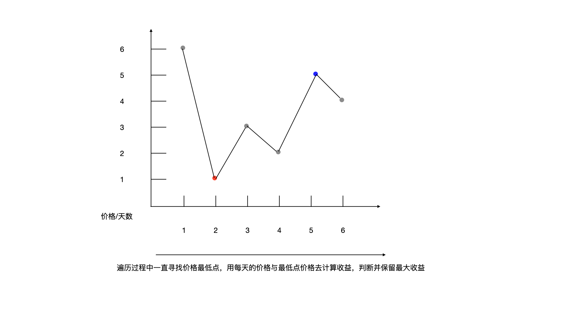

<!--more-->

<h1 align="center">leetcode 121.买卖股票的最佳时机</h1>

### 题目地址
  * https://leetcode.cn/problems/best-time-to-buy-and-sell-stock/

### 解法
  1. 遍历
  * 按照常识来考虑，最大收益肯定是在价格最低点买入，然后在最高点卖出
  
  * 根据这个思路，只需要在遍历过程中不断维持一个最低点，然后用每天的价格去算卖出后收益，就可以得到最终的最大收益
    ```C++
    int maxProfit(vector<int>& prices) 
    {
        int min_price = 1e5; //买入的最低价格
        int max_profit = 0;
        for (int i = 0; i < prices.size(); ++i)
        {
            min_price = min(min_price, prices[i]);
            int profit = prices[i] - min_price;
            max_profit = max(max_profit, profit);
        }
        
        return max_profit;
    }
    ```
