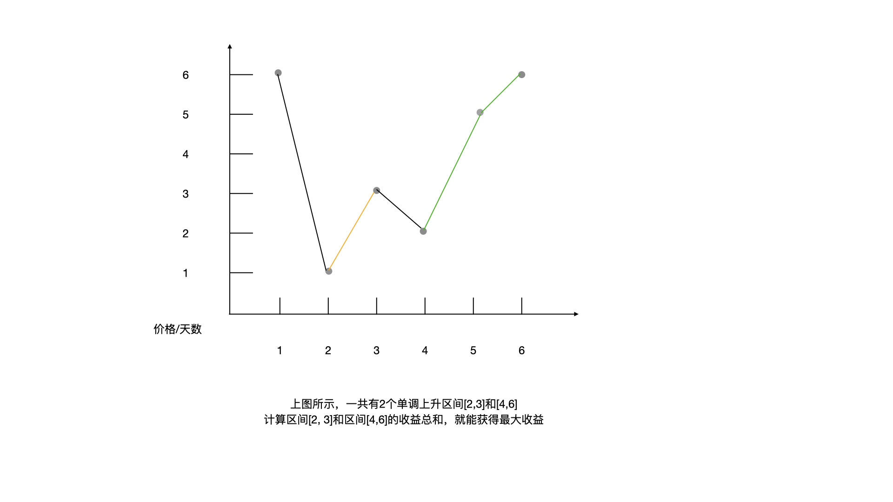
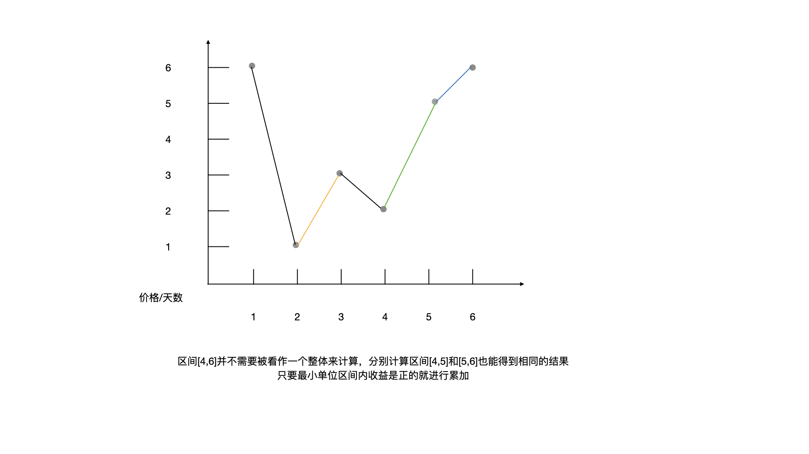

<!--more-->

<h1 align="center">leetcode 122.买卖股票的最佳时机 II</h1>

### 题目地址
  * https://leetcode.cn/problems/best-time-to-buy-and-sell-stock-ii/

### 解法
  1. 遍历
  * 根据题目评论区留言获得的启发，使用常识去思考这个问题，要获得最大收益，则只需要计算出所有呈上升趋势的段落的收益即可
    
  * 在遍历过程中标记每一段的低点作为买入点，再该段落最高点卖出(下降前)，累计每段收益即可得到最终结果
    ```C++
    int maxProfif(vector<int>& prices)
    {
        int sum = 0;
        int buy_index = -1; //买入的位置
        for (int i = 0; i < prices.size(); ++i)
        {
            if (buy_index == -1)
            {
                //定位某一小段的价格最低点为买入位置
                if (i + 1 < prices.size() && prices[i] < prices[i + 1])
                {
                    buy_index = i;
                }
            }
            else
            {
                //达到最高点，需要卖出，计算收益
                if (i == prices.size() - 1 || prices[i] > prices[i + 1])
                {
                    sum += prices[i] - prices[buy_index];
                    buy_index = -1;
                }
            }
        }

        return sum;
    }
    ```
  
  2. 遍历简化版
  * 由于题目没有规定买入卖出的次数限制，所以其实不需要计算整个上升区间的收益，将每个上升区间划分为最小单位的段来计算，只要收益是正的就累加到总收益中，也能获得正确的结果
    
  * 相较于解法1，代码量更少，更容易理解
    ```C++
    int maxProfitSimplified(vector<int>& prices) 
    {
        int sum = 0;
        for (int i = 1; i < prices.size(); ++i)
        {
            int profit = prices[i] - prices[i - 1];
            sum += max(0, profit);
        }

        return sum;
    }
    ```
    