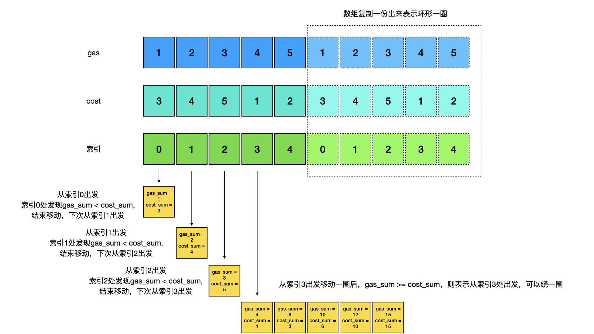
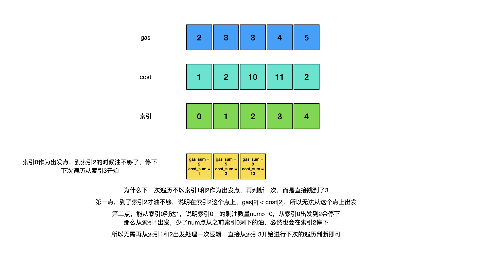

<!--more-->

<h1 align="center">leetcode 134.加油站</h1>

### 题目地址
  * https://leetcode.cn/problems/gas-station/

### 解法
  1. 双层遍历
  * 外层遍历，每次遍历将当前车站作为出发点，内部遍历模拟从出发点开始，经过n个车站(n为车站总数)，每经过一个车站，将其加油量和耗油量进行累计，当前加油总量小于耗油总量时，表示到达该车站后停止，无法继续前进，退出内部遍历。将停下位置的下一站作为下次的出发，继续外层遍历，如果内部遍历能经过所有n个车站，则外层遍历的出发点即为结果的出发点，否则当外层遍历使用了所有车站作为出发点后，仍不能经过所有n个车站，则表示不能完成一整圈，返回-1
    
  * 简单解释下为什么选择停下位置的下一站作为下次的出发点的原因。举例从车站1出发，到车站3油不够停下了，那么从车站2出发，肯定也会在车站3停下，因为从车站1到车站2的时候，车站1剩下的油肯定是大于等于0，带了额外的油都会在车站3停下，那直接从车站2开始，那也肯定会在车站3停下，所以外层遍历就不需要再从车站2和3开始再计算一次了，必然会在车站3停下，外层遍历直接从停下的位置车站3的后一站车站4开始即可
    
    ```C++
    int canCompleteCircuit(vector<int>& gas, vector<int>& cost) 
    {
        int n = gas.size();
        for (int i = 0; i < n;)
        {
            int gas_sum = 0;
            int cost_sum = 0;
            int pos = i;
            int count = 0;
            //从pos开始计算每个车站的加油量和消耗量，最多经过n个车站
            for (; count < n; ++count)
            {
                gas_sum += gas[pos];
                cost_sum += cost[pos];
                //油不够，退出循环
                if (gas_sum < cost_sum)
                {
                    break;
                }
                pos = (pos + 1) % n;
            }
            //经过了n个车站，返回起始点i
            if (count >= n)
            {
                return i;
            }
            //将停下位置的下一站作为下次的出发点
            i = i + count + 1;
        }

        return -1;
    }
    ```

  2. 单次遍历
  * 单次遍历过程中，累积每个车站加油量减去耗油量的值，保存在remain中，每次比较更新remain的最小值和其索引位置。遍历完成后，如果remain小于0，则表示所有车站的总加油量小于总耗油量，肯定是跑不完整圈的，返回-1，如果remain大于等于0，则表示从总量上来说是可以跑完一圈的，所以现在需要做的是找到正确的出发点
  * min_val会保留每次remain的最小值和所在的位置索引min_pos，那么min_pos的下一个位置i的加油量一定是大于等于耗油量的，即gas[i]>=cost[i]，min_pos为油量最低点，则[0,min_pos]这段一定是油量负增长段，[min_pos+1, n]这段一定是油量正增长段，由于题目中表示有解的话肯定是唯一解，所以油量正增长段的第一个点就是出发点，即min_pos的下一个位置
    ```C++
    int canCompleteCircuitOneLoop(vector<int>& gas, vector<int>& cost) 
    {
        int remain = 0; //累计加油量减去耗油量的值
        int min_val = 1e9; //remain最小值
        int min_pos = 0; //remain最小值时的索引位置
        for (int i = 0; i < gas.size(); ++i)
        {
            int temp = gas[i] - cost[i];
            remain += temp;
            if (remain < min_val)
            {
                min_val = remain;
                min_pos = i;
            }
        }
        return remain < 0 ? -1 : (min_pos+1) % gas.size();
    }
    ```
