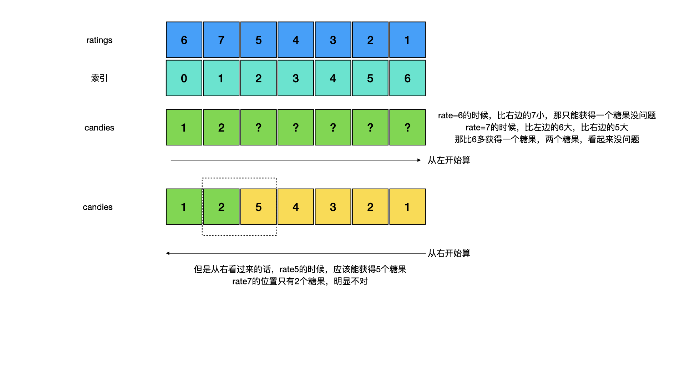
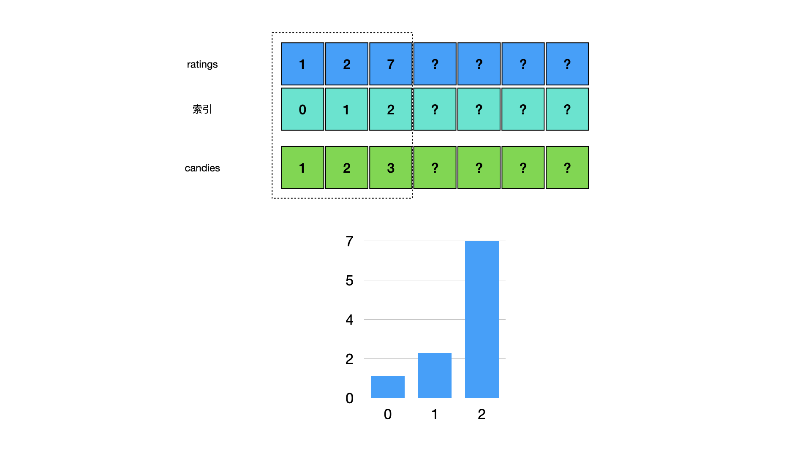
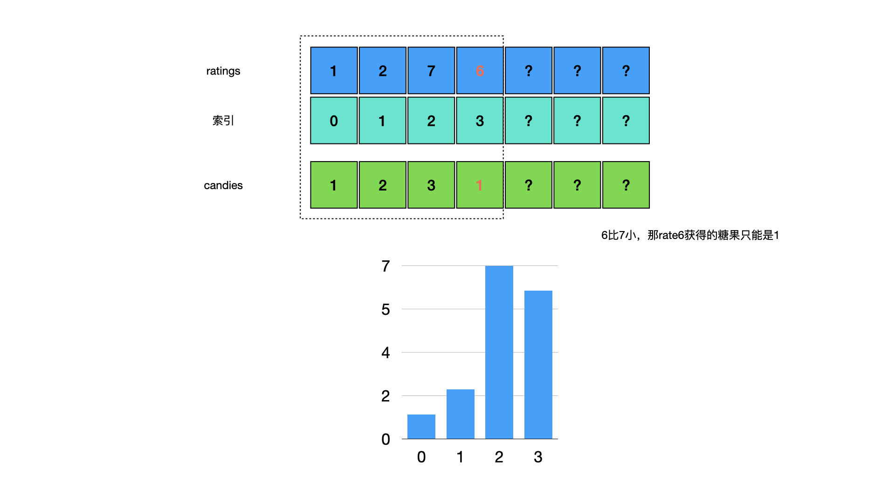
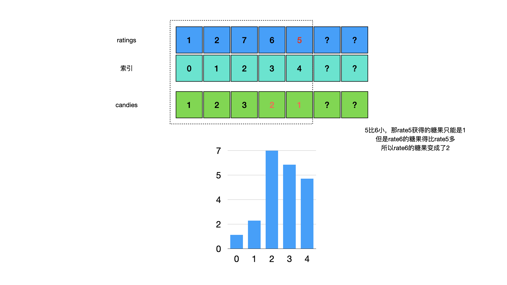
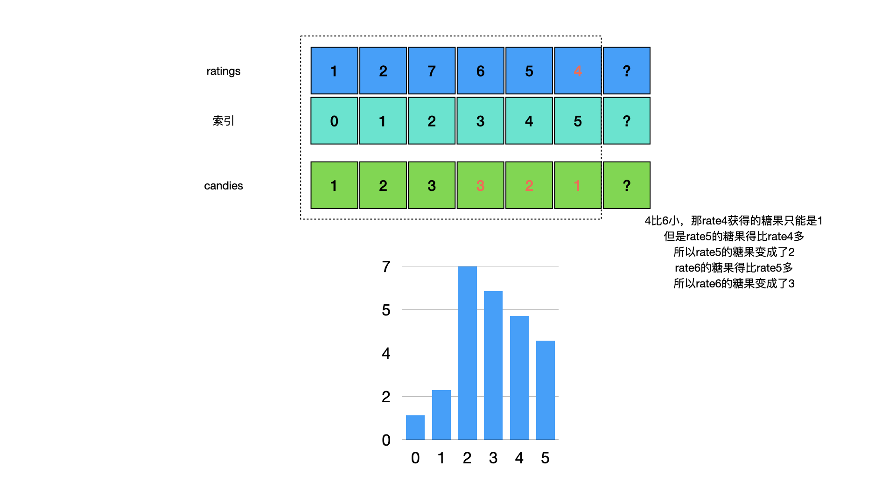
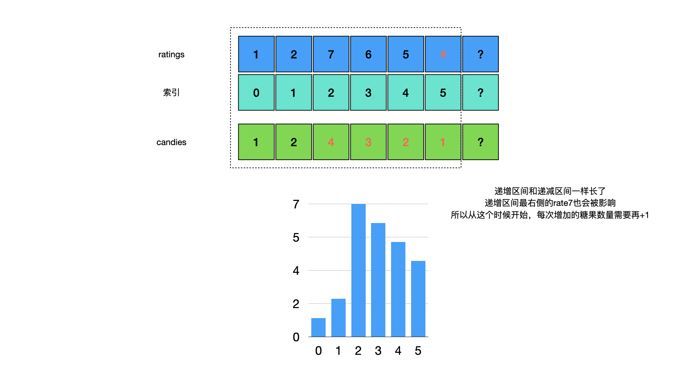
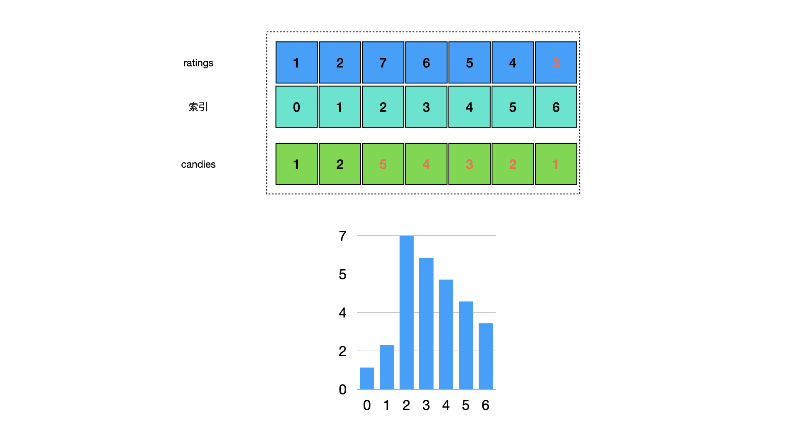

<!--more-->

<h1 align="center">leetcode 135.分发糖果</h1>

### 题目地址
  * https://leetcode.cn/problems/candy/

### 解法
  1. 两次遍历
  * 刚开始最直接想到的是只用一次遍历，然后判断每个rate与左右rate的大小就可以了，但是实际测试下来发现是无法获得正确结果的。假设当前rate比自身左右的rate都大，那当前rate获得的个数看起来应该是2，但是该rate右侧是一个长度为5的递减区间，从右边算起的话，当前rate右边的rate能获得的糖果个数是5，当前rate获得的个数是2，明显不满足题目中要求(相邻rate中的较大者，获得更多的糖果)
    
  * 所以需要从左右分别进行两次遍历，第一次从左遍历，使用数组保存从左遍历后每个rate获得的糖果个数，如果比左边的值小，就获得一个糖果，否则比左侧rate多获得一个糖果。然后再从右遍历一次，与右边的rate进行比较，计算出当前rate可获得的糖果数，然后与之前从左侧遍历获得的糖果数比较取较大值，才是实际获得的糖果数，并累加到结果中
    ```C++
    int candy(vector<int>& ratings) 
    {
        vector<int> nums(ratings.size(), 0);
        nums[0] = 1;
        for (int i = 1; i < ratings.size(); ++i)
        {
            if (ratings[i] > ratings[i-1])
            {
                nums[i] = nums[i-1] + 1;
            }
            else
            {
                nums[i] = 1;
            }
        }

        int n = 0;
        int temp = 1;
        for (int i = ratings.size() - 1; i >= 0; --i)
        {
            if (i < ratings.size() - 1 && ratings[i] > ratings[i+1])
            {
                ++temp;
            }
            else
            {
                temp = 1;
            }
            //左侧遍历获得的糖果数与右侧遍历获得的糖果数，取较大值
            n += max(temp, nums[i]);
        }

        return n;
    }
    ```
  

  2. 不使用额外内存空间
  * 解法1使用了左右两次遍历的方法，所以使用了额外的数组来保存第一次遍历的结果，如果能处理好当前rate右侧的递减序列影响当前rate获得糖果数的问题的话，其实可以不用两次遍历和额外数组，只需要一次遍历就能完成
  * 需要划分出ratings的递增和递减区间来处理，解法1中提到的一个问题就是，单次遍历时在遇到递增区间的最高点之后，遇到很长的一段递减区间，导致该递减区间最左侧rate实际能获得的糖果数非常多，超过了递增区间最右侧rate获得的糖果数，会出现题目要求的条件不成立的情况(相邻rate大的获得更多的糖果)。因此才需要进行左右两次遍历来完成，那么如果在单次遍历的时候，在递增区间最右侧的rate，根据之后可能出现的递减区间的长度，增加自己能获得的糖果数，就能解决这个问题
  * 假设一个递增区间[1,2,7]，从左侧开始遍历，那么这3个位置获得糖果分别为[1,2,3]
    
  * 如果7之后开始出现递减区间了，比如[1,2,7,6]，那么这4个位置获得的糖为[1,2,3,1]，rate6只能获得一个糖果，因为没有相邻的rate大
    
  * 如果6之后继续递减，比如[1,2,7,6,5]，rate5肯定只能获得一个糖果，rate6得多获得一个糖果，所以这5个位置获得的糖果为[1,2,3,2,1]
  * 总体上来说比之前多了2个糖果，rate5本来就是1个糖果，rate6多获得了1个糖果，其实就是多获得了"递减区间长度"个数的糖果
    
  * 如果5之后继续递减，比如[1,2,7,6,5,4]，rate4还是获得一个糖果，rate5多获得一个糖果变成2个，rate6多获得一个糖果变成3个，总体多获得了3个糖果，这6个位置获得的糖果为[1,2,3,3,2,1]，rate7获得的糖果是3，rate6获得的糖果是3，不符合题目条件，相邻大的rate获得的糖果更多
    
  * 这种情况下，我们发现递增区间和递减区间一样长了，递增区间最右侧rate获得的糖果数需要被递减区间的长度影响，获得的糖果数需要变多(rate7获得的糖果数得比rate6多)，所以当递增区间长度和递减区间一样长的时候，我们就需要把每次增加的糖果数+1，保证递增区间最右侧的rate获得糖果数肯定大于递减区间最左侧rate的糖果数，糖果数量应该为[1,2,4,3,2,1]
    
  * 所以如果4之后再递减的话，递减区间长度是4，但是由于rate7被影响的原因，所以这次需要增加的糖果数量应该是5，所以糖果数量应该是[1,2,5,4,3,2,1]
    
  * 根据递增区间和递减区间长度影响获得糖果总数的分析，我们可以得到下面的代码
    ```C++
    int candyNoExtraSpace(vector<int>& ratings)
    {
        int inc_len = 1; //递增区间长度
        int temp_inc_len = 1; 
        int dec_len = 0; //递减区间长度
        int temp = 1; //糖果数
        int result = 1; //总糖果数
        for (int i = 1; i < ratings.size(); ++i)
        {
            //递增区间
            if (ratings[i] >= ratings[i-1])
            {
                ++inc_len; //递增区间长度+1
                ++temp; //糖果数+1
                dec_len = 0;
                if (ratings[i] == ratings[i-1]) //相等
                {
                    temp = 1; //当前糖果数变为1
                    inc_len = 1; //递增区间长度回到1
                }
                temp_inc_len = inc_len; //保存递增区间长度
                result += temp; //累加糖果数
            }
            else
            {
                inc_len = 1; //递增区间长度重置为1(下次可能从这个位置开始递增)
                ++dec_len; //递减区间长度+1
                if (dec_len == temp_inc_len) 
                {
                    //递减区间和递增区间一样长了，影响递增区间最右侧rate的糖果数，dec_len需要+1
                    ++dec_len; 
                }
                result += dec_len; //递减区间长度即为需要多获得的糖果数
                temp = 1; 
            }
        }

        return result;
    }
    ```