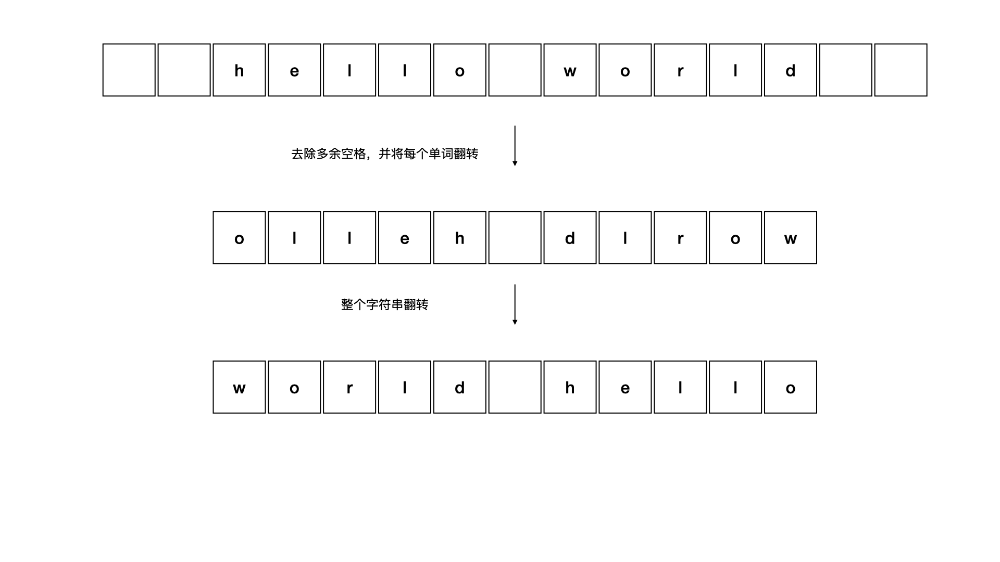

<!--more-->

<h1 align="center">leetcode 151.反转字符串中的单词</h1>

### 题目地址
  * https://leetcode.cn/problems/reverse-words-in-a-string/
  
### 解法
  1. 遍历+翻转
  * 不使用额外空间，遍历一次字符串，去掉所有多余的空格，每个单词之间只保留一个空格，并将单个单词翻转，再将整个字符串翻转即可
    
    ```C++
    string reverseWords(string s) 
    {
        int index = 0;
        int start = 0; //单次的起始位置
        bool space_once = true; //已出现过一个空格
        //去掉所有多余的空格，每个单次之间只保留一个空格，并且江单个单词翻转
        for (int i = 0; i < s.size(); ++i)
        {
            if (s[i] == ' ')
            {
                if (space_once)
                {
                    continue;
                }
                reverse(s.begin() + start, s.begin() + index);
                s[index++] = s[i];
                start = index;
                space_once = true;
            }
            else
            {
                space_once = false;
                s[index++] = s[i];
            }
        }
        //如果结尾是空格，也去掉
        if (s[index - 1] == ' ')
        {
            index -= 1;
        }
        s = s.substr(0, index);
        reverse(s.begin() + start, s.end()); //翻转最后一个单次
        reverse(s.begin(), s.end()); //翻转整个字符串
        
       return s;
    }
    ```