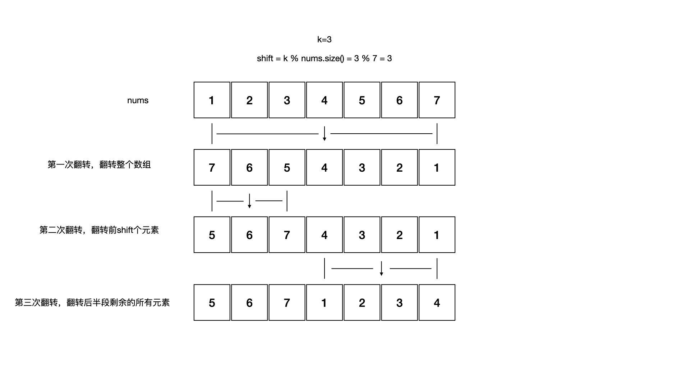

<!--more-->

<h1 align="center">leetcode 189.轮转数组</h1>

### 题目地址
  * https://leetcode.cn/problems/rotate-array/

### 解法
  1. 数组
  * 第一时间想到的最简单的解法，使用临时数组变量作为nums的副本，计算每个值的新位置，然后设置到结果数组中
    ```C++
    void rotate(vector<int>& nums, int k)
    {
        if (nums.size() == 0)
        {
            return;
        }
        int shift = k % nums.size();
        if (shift == 0)
        {
            return;
        }
        vector<int> temp = nums;
        for (int i = 0; i < temp.size(); ++i)
        {
            int index = (i + k) % nums.size();
            nums[index] = temp[i];
        }
    }
    ```

  2. 翻转
  * 根据题目中提示"部分翻转"而得到的启发，通过3次翻转即可得到轮转的结果
  * 第一次，翻转整个数组
  * 第二次，翻转前shift(shift = k % nums.size())个元素
  * 第三次，翻转剩下后半段的所有元素
    
    ```C++
    void rotateReverse(vector<int>& nums, int k)
    {
        if (nums.size() == 0)
        {
            return;
        }
        int shift = k % nums.size();
        if (shift == 0)
        {
            return;
        }
        reverse(nums.begin(), nums.end());
        reverse(nums.begin(), nums.begin() + shift);
        reverse(nums.begin() + shift, nums.end());
    }
    ```
