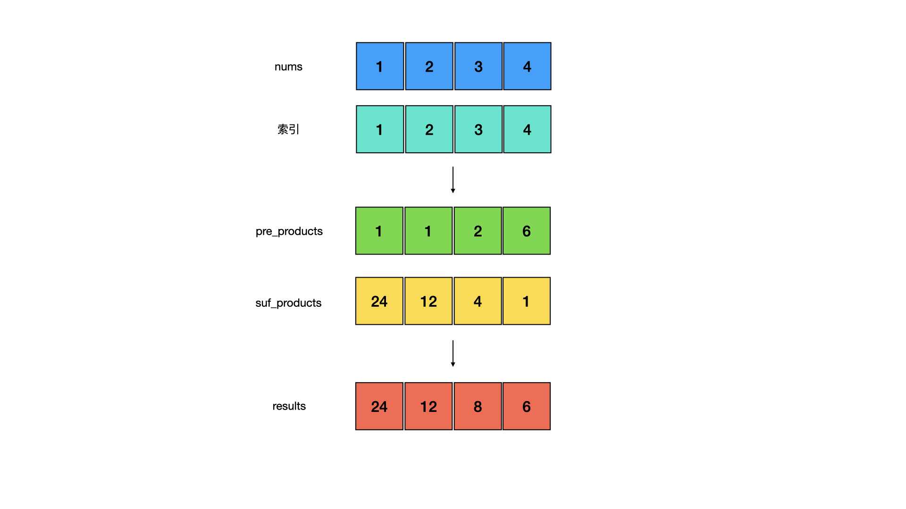
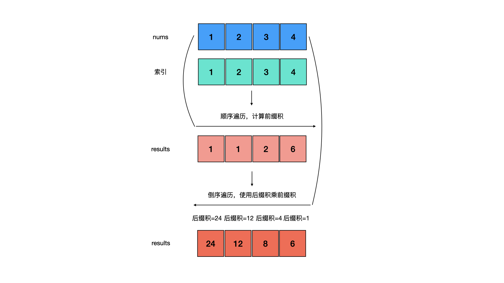

<!--more-->

<h1 align="center">leetcode 238.除自身以外数组的乘积</h1>

### 题目地址
  * https://leetcode.cn/problems/product-of-array-except-self/

### 解法
  1. 前缀积+后缀积
  * 使用两个额外的数组pre_products和suf_products表示前缀积和后缀积，pre_products[i]表示nums[i]之前所有元素的乘积，suf_products[i]表示nums[i]之后所有元素的乘积。通过顺序遍历构建pre_products，倒序遍历构建suf_products，所以在nums[i]在数组中不包括自己的所有元素的乘积为pre_products[i] * suf_products[i]
    
    ```C++
    vector<int> productExceptSelf(vector<int>& nums) 
    {
        vector<int> pre_products(nums.size(), 1); //前缀积，pre_products[i]表示nums[i]之前所有元素的乘积
        vector<int> suf_products(nums.size(), 1); //后缀积，suf_products[i]表示nums[i]之后所有元素的乘积
        int product = nums[0];
        for (int i = 1; i < nums.size(); ++i)
        {
            pre_products[i] = product;
            product *= nums[i];
        }
        product = nums[nums.size() - 1];
        for (int i = nums.size() - 2; i >= 0; --i)
        {
            suf_products[i] = product;
            product *= nums[i];
        }
        
        vector<int> results(nums.size(), 1);
        for (int i = 0; i < results.size(); ++i)
        {
            //nums[i]在数组中不包括自己的所有元素的乘积为pre_products[i] * suf_products[i]
            results[i] = pre_products[i] * suf_products[i];
        }

        return results;
    }
    ```

  2. 不使用额外空间
  * 与解法1不同之处在于，不使用额外的两个数组来保存前缀积和后缀积，直接使用结果数组results即可。先顺序遍历，将前缀积保存在results数组中，当前results[i]表示nums[i]之前所有元素的乘积，第二次遍历从尾部开始，用一个变量实时记录当前的后缀积，并且与results[i]相乘，就能得到最终结果
    
    ```C++
    vector<int> productExceptSelfNoExtraSpace(vector<int>& nums) 
    {
        vector<int> results(nums.size(), 1);
        results[0] = 1;
        //第一次遍历后，results[i]表示nums[i]之前所有元素的乘积
        for (int i = 1; i < nums.size(); ++i)
        {
            results[i] = results[i - 1] * nums[i - 1];
        }
        //product在倒序遍历中，实时记录当前的后缀积
        int product = 1;
        for (int i = nums.size() - 1; i >= 0; --i)
        {
            results[i] *= product;
            product *= nums[i];
        }

        return results;
    }
    ```
