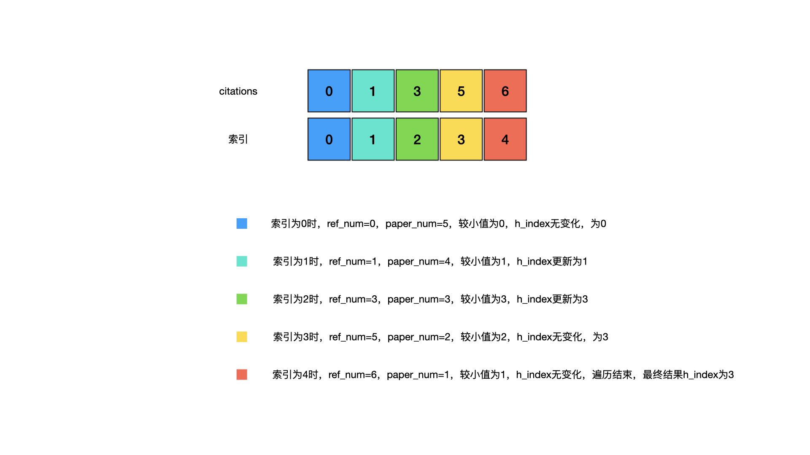

<!--more-->

<h1 align="center">leetcode 274.H 指数</h1>

### 题目地址
  * https://leetcode.cn/problems/h-index/

### 解法
  1. 排序遍历
  * 对数组进行排序，然后遍历数组，每次遍历获得当前论文的引用数量，以及大于等于该引用数量的论文数量，两者取最小值，满足题目中"至少有h篇论文被引用次数大于等于h"的条件要求，h指数结果则尽可能选择更大的数值
  * 定义引用数量为ref_num，引用数量大于等于ref_num的论文数量为paper_num，h_index用来保存结果，如下图所示
    
    ```C++
    int hIndex(vector<int>& citations)
    {
        sort(citations.begin(), citations.end());
        int h_index = 0;
        for (int i = 0; i < citations.size(); ++i)
        {
            int ref_num = citations[i]; //引用数量
            int paper_num = citations.size() - i; //引用数量大于等于ref_num的论文数量
            int temp = min(ref_num, paper_num); //取较小者
            h_index = max(h_index, temp); //h指数的值要求尽可能的大
        }

        return h_index;
    }
    ```

