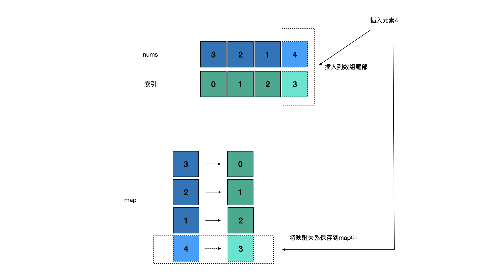
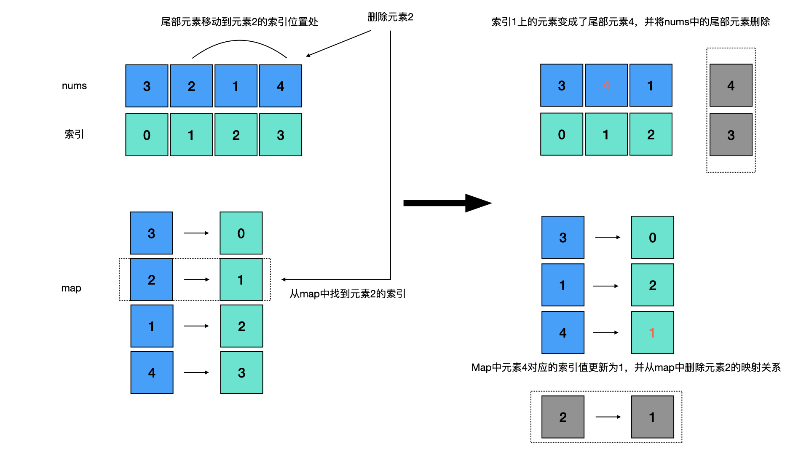

# Leetcode 380.O(1) 时间插入、删除和获取随机元素


<!--more-->

<h1 align="center">leetcode 380.O(1) 时间插入、删除和获取随机元素</h1>

### 题目地址
  * https://leetcode.cn/problems/insert-delete-getrandom-o1/

### 解法
  1. 数组+哈希表
  * 题目要求实现的3个函数insert,remove,getRandom,都需要O1的时间复杂度，所以需要使用数组+哈希表的方式来实现。数组中存储元素，哈希表中存储元素及其在数组中索引位置的映射关系，通过哈希表来实现O1时间复杂度的insert和remove函数，通过数组来实现O1时间复杂度的getRandom函数
  * 实现insert函数时，将元素插入到数组尾部，并将该元素在数组中的索引以映射关系的方式存储在哈希表中
    
  * 实现remove函数时，首先从哈希表中获取待删除元素的索引，在数组中将尾部元素赋值到待删除元素所在的索引位置，并重新建立该尾部元素的索引映射关系，然后将数组尾部元素删除，并在哈希表中删除待删除元素的映射关系，从而完成从数组和哈希表中同时删除掉待删除元素的操作。特别需要注意的是，"从哈希表中删除待删除元素"的这步操作一定要放在"重新建立尾部元素的映射关系"之后，来保证当数组中只剩下待删除元素时，不会在哈希表中留下错误的数据
    
    ```C++
    class RandomizedSet 
    {
    public:
      RandomizedSet() 
      {
          srand(time(NULL));
      }
    
      bool insert(int val) 
      {
          if (nmap_.find(val) != nmap_.end())
          {
              return false;
          }
          //将val放入数组中，并将val在数组数组中的索引作为映射关系存储在nmap中
          int len = nums_.size();
          nums_.push_back(val);
          nmap_[val] = len;
          return true;
      }
    
      bool remove(int val) 
      {
          auto it = nmap_.find(val);
          if (it == nmap_.end())
          {
              return false;
          }
          int index = it->second; //被删除元素val在数组中的索引
          int last_val = nums_[nums_.size() - 1]; //数组尾部元素
          nums_[index] = last_val; //将尾部元素赋值到被删除元素的索引位置
          nmap_[last_val] = index; //为尾部元素重新建立索引的映射关系
          nums_.pop_back(); //删除数组尾部元素
          nmap_.erase(val); //从nmap中删除val，这一步必须放在"nmap_[last_val] = index"后执行，防止数组中只剩val的情况，即last_val=val，val被删除后又给last_val重新建立了映射关系
          return true;
      }
    
      int getRandom() 
      {
          int index = rand() % nums_.size();
          return nums_[index];
      }

      private:
          vector<int> nums_;
          unordered_map<int, int> nmap_; //key--num，value--num在数组中的索引
      };
    ```


---

> Author: Ciao  
> URL: http://localhost:1313/blog/posts/3224025/  

