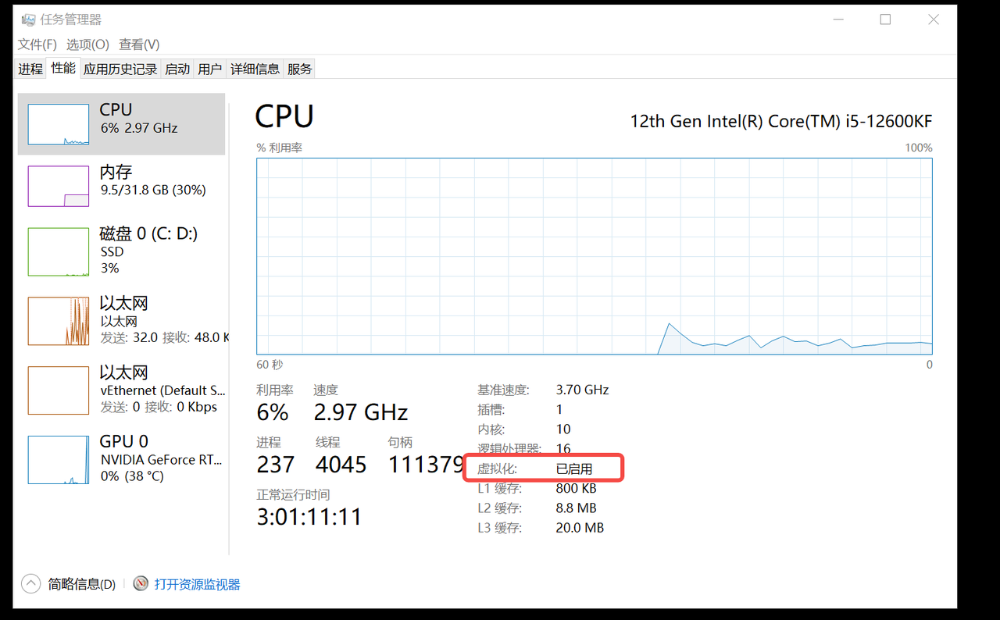
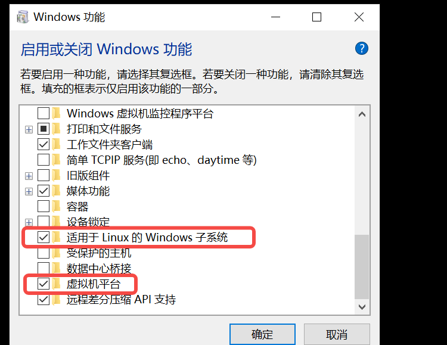

# Wsl简易使用技巧


<!--more-->

<h1 align="center">wsl简易使用技巧</h1>

### 概述
  * 记录一些wsl的简易使用技巧

### 安装wsl前的准备工作
  * 进入bios开启intel(vmx) Virtualization选项(amd的cpu开启amd-v选项)
  * 确认开启虚拟化
    
  * 确认开启windows功能
  
    

### 常用命令
  * 安装 
    ```Shell
    wsl --install --web-download
    ```
  * 查看可安装发行版本列表
    ```Shell
    wsl --list --online
    ```
  * 查看当前已安装发行版本
    ```Shell
    wsl --list -v
    ```
  * 设置默认子系统
    ```Shell
    wsl --set-default [xxx]
    ```
  * 启动子系统 
    ```Shell
    wsl -d [xxx]
    ```
  * 删除子系统
    ```Shell
    wsl --unregister xxx
    ```


---

> Author: Ciao  
> URL: http://localhost:1313/blog/posts/9a6f84d/  

