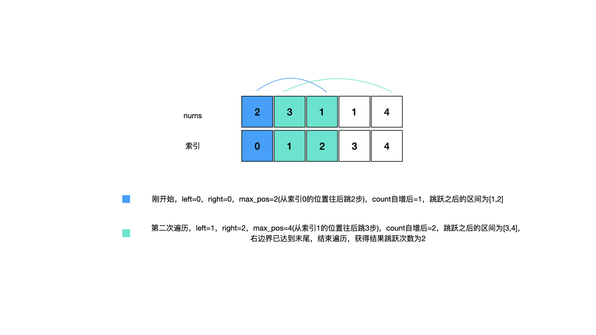

# Leetcode 45.跳跃游戏 II


<!--more-->

<h1 align="center">leetcode 45.跳跃游戏 II</h1>

### 题目地址
  * https://leetcode.cn/problems/jump-game-ii/
  
### 解法
  1. 贪心
  * 根据当前所在位置和能到达的最远距离，计算下一次可以达到的最远距离，每计算一段，就自增一次count，最终得到跳跃次数
  * 如下图所示，使用left和right两个索引值来表示当前可到达的区间，max_pos表示当前能到达的最远距离，count用来记录跳跃的次数
    
    ```C++
    int jump(vector<int>& nums) 
    {
        int count = 0; //跳跃次数
        int left = 0; //区间左侧索引
        int right = 0; //区间右侧索引
        for (; right < nums.size() - 1; )
        {
            int max_pos = 0; //最远距离
            //left和right为当前可到达的区间，在可到达区间内计算下次跳跃能到达的最远位置
            for (int i = left; i <= right; ++i)
            {
                max_pos = max(max_pos, i + nums[i]);
            }
            //自增跳跃次数，并定位到下一个区间
            ++count;
            left = right + 1;
            right = max_pos;
        }

        return count;
    }
    ```

---

> Author: Ciao  
> URL: http://localhost:1313/blog/posts/9fc75a4/  

